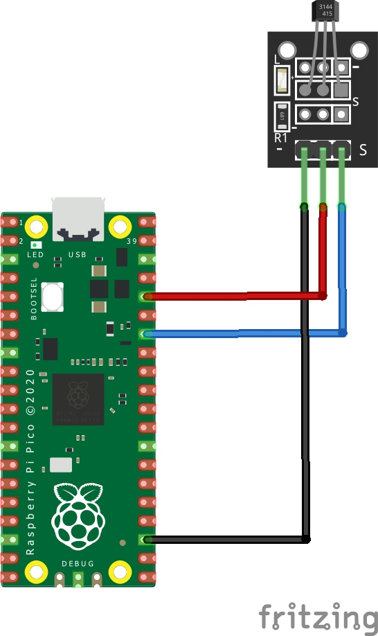

# Pico W HTTP Hamster Wheel Pedometer


This project uses a Pico W(H), a KY-003 sensor board and a sticky-backed magnet to count my hamster's wheel's rotations at night.


# Setup
The KY-003 sensor board is rated at 5v but I've found it works fine at 3v provided by the Pico. As the project uses the Pico's ADC to read the data, the data pin must be connected to the of the 3 working ADC pins, defined within `config.h`, I've chosen to use 28. You may use GPIO pins 26, 27, 28, which are ADC0, ADC1, ADC2 respectively. You may also need to change `adc_select_input(2)` to use the correct ADC module. The GND and 3v3 lines can be connected to the Pico's 3v3 and GND pins.



I have the hall effect sensor head-on towards the magnet, however based on the magnet used, you may need to re-adjust to ensure the magnet is only picked up once per revelation, and not twice (on field entry, on field leave).


```
git clone the repo
cd hamptometer
git submodule update --init picowota
mkdir build
cd build
cmake .. -DPICO_BOARD="pico_w" -DWIFI_SSID="your_ssid!!" -DWIFI_PASSWORD="your_password!!"
make # or make -j16 where 16 is your number of cores if you want multithreaded compilation, otherwise ignore the flag
picotool load main.uf2 -f # or however you want to load it, drag-and-drop or openocd also work great
```

The Pico will leave it's LED on while setting up, and turn it off once connected to Wi-Fi and setup the HTTP server. 

### Picowota
To reflash the Pico without connecting it to your PC we use Picowota, this puts a Wi-Fi bootloader into flash that connects to Wi-Fi. You'll need to install `serial-monitor` to update the Pico over Wi-Fi, as well as initially flash the `picowata_main.uf2` to get the bootloader.  


## Acknowledgements

Thank you to LearnEmbeddedSystems for their webserver template! Which is licensed under MIT in the `network/` folder.
https://github.com/LearnEmbeddedSystems/pico-w-webserver-template

Thank you to usedbytes for making Picowota! Which is extremely useful to not disturb the expertly ducttaped Pico!


## TODO:
    - Add counter update without refresh
    - Remote flashing
    - Long term data storage
        - Add an NTP client to setup the RTC 
        - Ideally each spin even will have a recorded time, ideally in milisecond precision 
        - Potentially some sort of data base
        - Add web graphs
    - Speed analytics
        - Max time beetween spin
        - Avg time between spin (ignoring stopped times)
        - Test whether the magnet potentially sets off the sensor twice (on field entry, on field leave) and mitigate
    - Allow export of data
        - Potentially store data in flash or another Linuxy device that can host the webpage better.
    - Customise wheel size in browser (and do maths in browser too, with some Javascript I presume)
    - Add some CSS
